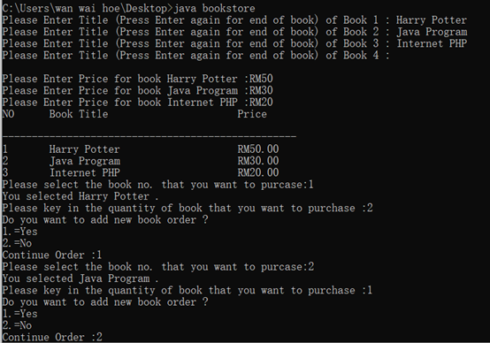
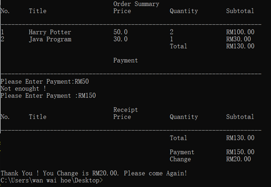

# Java Bookstore System

This is a simple **Bookstore System** developed in Java using Notepad as part of my academic project.  
It features a basic inventory system to record book names and prices, along with a simple calculation and purchase mechanism.

## Features

- Record book name and price
- Calculate total price and purchase

## Technologies Used

- Java (Notepad + Manual Compilation)
- Basic File I/O (no database)
- CLI / Text-based UI

## Screenshots

  


## Demo Video

[Click here to watch the demo](https://youtu.be/TpLpl540Oxc)

## How to compile and run

1. Open Command Prompt and navigate to the `src` folder:

   ```
   cd Java-Bookstore-System\src

   ```

2. Compile

   ```
   javac bookstore.java

   ```

3. Run

   ```
   java bookstore

   ```
=======
# Java-BookStore-System
A simply BookStore system build using Notepad and Java during college
>>>>>>> ee5338f6cd10e9efb5497510432a08673a26c643
